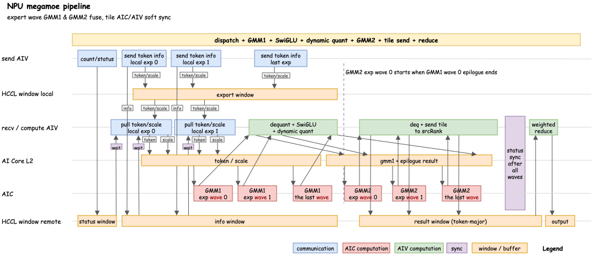

# MoE 通算融合: Ascend FusedMoE v.s. CUDA MegaMoE

FusedMoE 和 MegaMoE 把 routed expert 的 dispatch, gmm1, SwiGLU, quant, gmm2, combine 放进同一条 device/kernel 侧执行流程里, 目标是尽量把跨 rank token/result 搬运藏进 AIC 的矩阵乘时间里.

<p align="center">
  
</p>

## Ascend FusedMoE

该算子的通算掩盖分为两个独立的流程, 两个独立流程之间无并行和掩盖:

<p align="center">
  
</p>

1. fused gmm 1: 先统计本 rank 要发送给所有专家的路由情况, 然后写到目标卡的 HBM, 同时目标卡以**专家粒度**来收取数据, 并以**专家粒度**来触发 GMM1 计算;

<p align="center">
  
</p>

- count: 对每个全局路由 expert 扫描本地所有路由项, 统计每个 globalExpert 的 token 个数; 多个 AIV 按照专家区间分工, 每个 AIV 负责一段专家编号; 统计后写到对端 status window;

```
dstRank.statusWindow[localExpertId][srcRank] = {ready, count}
```

- send token: 对每个 local expert group, 扫描本地所有路由项, 命中 group 则将 token/scale 写入 `dstRank.localExpert`; 多个 AIV 按照路由区间分工;

<p align="center">
  
</p>

- recv token: 对每个 local expert, 等待 count 就位, 再等待 token 就位, 按照专家粒度把每个 `dstRank[localExpert][srcRank][slot]` 搬运到 AI Core 的全局内存 L2;

<p align="center">
  
</p>

2. fused gmm 2: 按照 tile 粒度进行专家计算并写回源卡, 等待全部专家计算完成后再进行加权求和以及重排;

<p align="center">
  
</p>

## CUDA MegaMoE

<p align="center">
  
</p>

1. L1 与 L2 之间是 wave 流水, L1 的 wave 0 算完后, 等待所有 epilogue warps 按 tile 写完 L2 buffer, 就进行 L2 计算;

2. 专家权重计算放在 L1 wave 的 epilogue 里;

3. L2 拿到的 metadata 可以将计算结果写到源 rank 的 combine buffer 中对应 token 和 topK slot, 无需在 combine 是做 unpermute;


## 分析与改进

MegaMoE 给出的关键启发有 2 个:

1. 在 dispatch 阶段就记录源 token 元信息: `rank_idx, token_idx, topk_idx` (global expert index), L2 epilogue 写回时直接读取这份 metadata, 然后写到源 rank 的 combine buffer 中对应 token 和 topK slot;

2. 它把 topK weight 提前乘在 L1 epilogue 里, `SwiGLU * weight` 后再量化作为 L2 输入, 因此 final combine 只需要累加 topK contribution, 不需要再乘权重. Ascend 当前是在 `LocalWindowCopy` 里读 expert result, 乘路由权重, 再累加;

现在 Ascend GMM2 epilogue 已经做到 tile 级 send. `DoCombineSend` 根据 tile 覆盖的 expert 内 token slot 和 hidden offset, 再按 srcRank count 边界拆分写回 HCCL window, 但它写回的是 expert-major 布局. 后面的 `LocalWindowCopy` 还要按 token 扫 topK 专家, 用 `expandIdx` 找回 expert result slot, 再乘权重和累加.

3. expert wave 流水更容易提高 AIC 矩阵乘法效率;

Ascend FusedMoE 的改进有 2 个:

1. 修改 metadata. 每次路由都有 route entry:

```
srcRankId (uint8), srcTokenId (uint16), topkSlot (uint8, 0..K-1), dstRankId (uint8), localExpertId (uint8, expert id in dstRank), expertWeight(fp32)
```

```
dstRank.routeMeta[localExpertId][expertSlot] = {srcRankId, srcTokenId, topKSlot, expertWeight}
expertSlot (0..count)
```

2. 当前 dispatch push 改 pull;

当前 send AIV 把 token/scale 和描述信息分别写到 dstRank 的 HCCL window:

```
srcRank send AIV -> dstRank.dataWindow[srcRank][localExpertId][expertSlot] = {token, scale, tokenFlag}
srcRank send AIV -> dstRank.descWindow[srcRank][localExpertId][expertSlot] = {srcTokenOffset, srcScaleOffset, srcTokenId, topKSlot, expertWeight, readyFlag}
```

假设 dstRank.localExpertId 从 srcRank 接收 count 个 token, 则 `expertSlot` 取值范围从 0 到 count - 1;

pull 模式可以改成:

n 个 recv AIV 负责 1 个 localExpertId, 每个 recv AIV 轮询一段 srcRank, 先读取

```
dstRank.statusWindow[localExpertId][srcRank] = {ready, count}
```

得到:

```
`srcRank 0` 会给 `localExpertId` 发送 count[0] 条路由;
`srcRank 1` 会给 `localExpertId` 发送 count[1] 条路由;
...
```

然后去轮询:

```
dstRank.descWindow[srcRank][localExpertId][slot]
其中 slot 遍历 0...count[srcRank]-1
```

做搬运:

```
dstRank recv AIV -> 看到 readyFlag -> 从 srcRank.remoteTokenBuffer[srcTokenOffset] 拉 token -> 写入本地 gmX1
dstRank recv AIV -> 从 srcRank.remoteScaleBuffer[srcScaleOffset] 拉 scale -> 写入本地 gmX1Scale
```

Q0: AIV把本卡HBM的数据写到目标卡HBM上，用outstanding资源吗;
Q1: 普通 GM 地址注册为 HCCL window 之后才能被对端 AIV 读, 能不能把存储 token 的那段 HBM 注册为 HCCL window, 这样的话省却一次本卡 HBM -> HBM 的搬运;
Q2: 这个点子多一次本地 HBM -> export window 的搬运;
Q3: send AIV 如何通知 recv AIV?

2. GMM1 和 GMM2 按 expert wave 融合

主要阻塞点在: 目前的 dynamic quant 是在 GMM1 所有专家完成后, 对 `totalTokenCount` 的整段 `SwiGLU` 输出统一启动. BlockQuant 内部按 tile 做 row-wise amax, scale, int8 cast.

要改成
`recv wave w done -> GMM1 wave w -> dynamic quant wave w -> mark wave w ready -> GMM2 wave w`

3. 改了 metadata 后, 在 gmm2 阶段可以不做 unpermute

expert 计算的 AIV 直接写:

`srcRank.resultWindow[srcTokenId][topK slot][hiddenSlice]`

这样 `LocalWindowCopy` 就不再需要做 expert-major 到 token-major 的复杂 unpermute. 它可以直接按 token 读取 topK slot, 做 reduce. 这个改法和 MegaMoE 对齐, 风险明显小于 tile 级流式累加. 

4. 把 topk weight 放在 gmm2 epilogue 里做. MegaMoE 里是在 GMM1 后处理, 但直接这样改在 dynamic quant 阶段可能有精度风险. 前提是 GMM2 epilogue 所在的 topk rank 必须拿得到 topk weight. 如果 topk weight 还只留在 source rank, 那需要在 dispatch metadata 里把 topK weight 一起带到 topk rank, 或者在 count / token metadata 旁边补一个小的 weight buffer. 这个通信量很小, 每个 routed token 只多一个 FP32 或 FP16 / BF16 标量.

## 全新设计

<p align="center">
  
</p>

### Ascend C API

暂未定.

#### input

**矩阵和向量**
| 变量名 | 数据类型 | shape | 含义 |
| -- | -- | -- | -- |
| tokens_per_rank | int8 | [batch_size, hidden_dim] | 量化后的 tokens 矩阵, 共 batch_size 个 token |
| scales_per_rank | batch_size * 1 | fp32 | per token 量化因子 |
| w_gate | int8 | [hidden_dim, intermedia_dim] | 专家权重矩阵 |
| w_up | int8 | [hidden_dim, intermedia_dim] | 专家权重矩阵 |
| w_down | int8 | [intermedia_dim, hidden_dim] | 专家权重矩阵 |
| w_gate_scale | fp32 | [1, intermedia_dim] | per-channel scale |
| w_up_scale | fp32 | [1, intermedia_dim] | per-channel scale |
| w_down_scale | fp32 | [1, hidden_dim] | per-channel scale |
| topk_ids | int8, int16 | [batch_size, k] | 全体 token 对应的 topk 专家编号 |
| topk_weights | bf16, fp32 | [batch_size, k] | 全体 token 对应的 topk 专家权重 |

**标量**

| 变量名 | 数据类型 | 取值范围 | 含义 | 计算方式 | 典型值 |
| -- | -- | -- | -- | -- | -- |
| batch_size | uint16 | [0, 65535] | attention 结束时, 每个 rank 的 token 数量 | 如果开 MTP=x, 则 n*(x+1) | 96=24*(3+1) |
| hidden_dim | uint16 | [0, 65535] | 模型词表每个 token 向量的长度 | | 5120 |
| global_expert_num | uint16 | [0, 65535] | 模型的总 expert 数量 | | 384 |
| ep_rank_size | uint8 | [0, 255] | MoE 通信域 rank 数量 | | 64, 32 |
| expert_per_rank | uint16 | [0, 65535] | 1 个 rank 的 expert 数量 | global_expert_num / ep_rank_size | 6, 12 |

#### output

| 变量名 | shape | 数据类型 | 取值范围 | 含义 |
| -- | -- | -- | -- | -- |
| tokens_after_moe | [batch_size, hidden_dim] | bf16 | $-3.4\times 10^{38} \sim 3.4\times 10^{38}$ | 每个 rank 的所有 token 经过 MoE 网络处理后的值 |

#### 数学公式

假设 $x\in\mathbb{R}^{H}$ 是 1 个 token, 则它经过 MoE 处理后的输出为

$$
\text{MoE}(x) = \sum_{i=0}^{k-1} \omega_k \text{E}_k(x).
$$

其中 $\omega_k$ 为对应专家的 topk 权重, $\text{E}_k(x)$ 表示每个专家处理, 计算公式为 (无 bias):

$$
\text{E}(x) = \omega \text{FFN(x)} := \omega\text{SwiGLU}(xW_{\text{gate}}, xW_{\text{up}}) W_{\text{down}}.
$$

其中 $\text{SwiGLU}$ 为非线性函数 (激活函数), 定义为:

$$
\text{SwiGLU}(a, b) := \text{SiLU}(a) b = a\sigma(a)b = \dfrac{ab}{1+\text{e}^{-a}},\quad
a, b\in\mathbb{R}.
$$

对向量输入 $a, b\in\mathbb{R}^n$, $\text{SwiGLU}(a, b)$ 理解为逐元素计算. 

MoE 要处理卡上每一个 token, 伪代码如下:

```python
output.reshape(batch_size, hidden_dim)
for token_id from 0 to tokens_per_rank - 1:
    token_after_moe = 0
    for topk_expert_id from 0 to k-1:
        token_after_moe += topk_weight[topk_expert_id] * FFN(token)
    output[token_id] = token_after_moe 
return output
```

由于所有专家分布在多个 NPU 上, 所以在专家计算之前需要先把 token 发给对应专家 (dispatch), 专家算完后再发回源卡 (combine). 融合算子 megamoe 包括从 dispatch 到 combine 的所有行为.


#### pipeline

##### HCCL window init

每个 rank 在 HBM 上初始化公开内存, 称为 HCCL window, 其他 rank 可以在 HCCL window 进行读写;

- export window: 本卡 token/scale 暂存区, 等待对端拉取
- status window: count/status 写入区, 等待对端写入
- info window: 对端 token/scale 信息,  等待对端写入
- result window: 专家计算结果, 等待对端写入
- output: 整体计算结果

##### pull token

本卡 send AIV 与对端交换信息, 并且把本地的 token/scale 放到 export window 中等待对端来拉取: ready flag, 源 token 位置, 源 scale 位置, 源 token 编号, topk slot 编号

```
srcRank -> dstRank.descWindow[srcRank][localExpertId][slot] = {ready, srcTokenOffset, srcScaleOffset, srcTokenId, topKSlot, (expertWeight)}
```

对端 recv AIV 从 srcRank 的 export window 中拉取信息.

##### AIC/AIV 分工

| 硬件 | AIC | AIV |
| -- | -- | -- |
| A5 | 32 | 64 |
| A2/A3 | 24 | 48 |

- 偶数序号 AIV 负责 count, send token info, 称为 send AIV; 
- 奇数序号 AIV 负责 pull, 把 token 和 scale 从对端分别拉到本卡的 AI Core L2 buffer, 称为 recv AIV;
- 奇数序号 AIV 负责进行 gmm epilogue, 称为 compute AIV; 由于 recv AIV 按专家分组, gmm 按照专家 wave 启动, 如果 expert wave >= 1, 则能够保证 recv AIV 一定不会和 compute AIV 冲突; 但要注意, 如果 wave < 1, 即 1 个专家分到的 token 数在一波 gmm 计算中还算不完, 则 recv AIV 会和 compute AIV 冲突;

- 前一半 AIC 负责 gmm1 计算, 称为 gmm1 AIC; 全体 gmm1 AIC 投入 1 个 expert wave 的计算;
- 后一半 AIC 负责 gmm2 计算, 称为 gmm2 AIC; 全体 gmm2 AIC 投入 1 个 expert wave 的计算;

注: 更优化的话, 可以按照两个 C 矩阵的 shape 来分 AIC 资源.
[batch_size, hidden_dim], [hidden_dim, intermedia_dim] = [batch_size, intermedia_dim]
[batch_size, intermedia_dim], [intermedia_dim, hidden_dim] =  [batch_size, hidden_dim]

##### count/status

统计全局每个专家从本 rank 上分到多少个 token, 把统计结果写到对端的 HCCL window:

```python
# const srcRank (from 1 to ep_rank_size)
for localExpertId from 1 to expert_per_rank:
    dstRank.statusWindow[localExpertId][srcRank] = {status, count}
```

| 变量名 | 数据类型 | 取值范围 | 含义 |
| -- | -- | -- | -- |
| status | bool | 0, 1 | true 表示 count 已写入, false 表示 count 未写入 |
| count | uint16 | [0, 65535] | dstRank 上第 localExpertId 个专家收到来自 srcRank 的 count 个 token |

并行串行设计方案有 2 个:
1. 和当前 vllm-ascend 的 fusemoe 一致, 用一半的 AIV 来写 count/status, 另一半轮询本卡 `statusWindow`, 为 recv 做准备;
2. 用所有 AIV 来执行, 这一步和下一步完全串行;

不管是哪种方案, 都假设执行 count/status 任务的 AIV 有 `count_AIV_num` 个. 为避免重复写同一段内存, 各 AIV 按照专家来分工, 每个 AIV 负责 `global_expert_num/count_AIV_num` 或 `global_expert_num/count_AIV_num + 1` 个全局专家. 每个 AIV 的任务是:

```python
for globalExpertId from 0 to global_expert_num / count_AIV_num:
    count = 0
    dstRank = globalExpertId % expert_per_rank
    localExpertId = globalExpertId / expert_per_rank
    for tokenId from 0 to tokens_per_rank - 1:
        for topkSlotId from 0 to topk - 1:
            topkExpertId = routerTable[tokenId][topkSlotId]
            if (topkExpertId == globalExpertId)
                count++
    dstRank.statusWindow[localExpertId][srcRank] = {status, count}
```

##### fused gmm1 + gmm2

每张卡既是 srcRank 又是 dstRank.

srcRank: 把卡上每个 token 发给 topk 个专家, 收到回传的专家计算结果后, 计算每个 token 的 topk 加权求和;

dstRank: 接收来自 ep_rank_size 个卡的 token, 启动本卡每个专家的计算, 算完后发送给源卡.

这个阶段把 token/scale 传输, gmm1 计算, dequant, swiglu, dynamic quant, gmm2, dequant, combine 融合起来.

总体按照 token wave 来处理, 每收到 128 个 token 就启动 cube 核 (?), 总之控制 M 维刚好可以占满一半的 cube kernel; gmm1 的触发条件是按照专家顺序, 收齐了 $m$ 个 token; gmm2 的触发条件也一样; 有可能不同专家的 token 混在一起计算, 也就是 grouped matmul;

Grouped matmul 会涉及到不同专家权重矩阵, 如果多核切 K 轴会涉及到累加序的问题, 做确定性计算的话会需要额外的处理. 当前 vllm-ascend fusedmoe 实现中没有调用 ACLNN 的 GroupedMatmul 系列接口, 它在同一个 fused kernel 里直接调用了自己实现的两个 Catlass grouped matmul 模板. 

Gmm1 调的是 `GmmDeqSwigluQuant`, 语义上它类似 ops-transformer 里的 `GroupedMatmulSwigluQuantV2`, gmm1 的 AIC 先逐个 expert 做矩阵乘, AIV 在 tile / stage 粒度做 dequant + SwiGLU 后处理, 把结果写到一段连续的 SwiGLU output buffer; 等本 rank 上所有 local expert 的 GMM1 + SwiGLU 输出都完成后, 做一次同步, 然后 AIV 对**整段 float32 SwiGLU output** 按 token row 做 BlockQuant, 得到 GMM2 的 int8 输入和 fp32 scale;

Gmm2 调的是 `GmmDeq`, 语义上它更像 `QuantGroupedMatmulDequant`: int8 grouped matmul, per-token dequant. 但这里还把 combine 对象传进去, 所以后处理和 combine 有融合关系.

要做到 kernel 内细粒度的融合, 需要用到 [Catlass 库](https://gitcode.com/cann/catlass);

用放大镜去进行更细粒度的观察, gmm1 之后要做 dequant + swiglu + dynamic quant, 这 3 步都是由 AIV kernel 来做, gmm1 的内部处理是 tile 粒度, 每个 cube 核算一个 tile, 用 AIC 来做, 算完之后交给 AIV (如果是 A5, 可以直接从 L0C 写到 UB, 再由 AIV 消费; 如果是 A2/A3, 从 L0C 写到 L2, 再从 L2 拉到 UB, 由 AIV 消费).

## 附录

设全局专家有 $E$ 个, 每个 rank 上 token 有 $T$ 个, 每个 token 的 top-k 值为 $K$.

### count/status

**路由计算**是从 $H$ 维 token 向量空间到 $E$ 维向量空间的线性映射, 设 token 为 $x\in\mathbb{R}^{H}$, 路由矩阵为 $W_{\mathbf{router}}$, 则路由计算可以写成:

$$
f: \mathbb{R}^{H} \to \mathbb{R}^{E}, \quad
f(x) = x W_{\text{router}},\quad x \mapsto \omega.
$$

整个 rank 的 token 空间是一个 $T\times H$ 矩阵 $X$, $T\ll H$, 

$$
f(X) = XW_{\text{router}} \in \mathbb{R}^{T\times E}.
$$

**Top-k 计算** 是从 $\mathbb{R}^{E}$ 到 $\mathbb{R}^{E}$ 的非线性映射, 它不改变该 $E$ 维向量的最大的 $K$ 个值, 同时把其他元素置零, 记为 $\kappa$.

**统计每个全局专家会收到多少个来自固定 rank 的 token** 是从 $\mathbb{R}^{T}$ 到 $\mathbb{R}$ 的非线性映射, 可以认为它是这样的复合映射, 记为 $g$:
$$
\begin{pmatrix}
0 \\ 0.2 \\ 0 \\ 0.3 \\
\end{pmatrix} \overset{g_1}{\mapsto}
\begin{pmatrix}
0 \\ 1 \\ 0 \\ 1 \\
\end{pmatrix} \overset{g_2}{\mapsto}
2,\quad g = g_2\circ g_1.
$$

其中 $g_1$ 是从 $\mathbb{R}^{E}$ 到 $\mathbb{R}^{E}$ 的非线性映射, 逐元素地把非零元映射成 $1$; $g_2$ 是一个线性映射, i.e., 对 $x\in\mathbb{R}^E$, 

$$
g_2(x) = \mathbf{1}_{E}^{\mathbf{T}}x, \quad \mathbf{1}_{E} = (1, 1, \cdots, 1) \in \mathbb{R}^{E}.
$$

设 rank $i$ 的 token 为 $X_i$, $X_i\in\mathbb{R}^{T\times H}$, 则以上过程可以表示为:

$$
\mathbb{R}^{T\times H}\overset{f}{\to} \mathbb{R}^{T\times E} \overset{\kappa}{\to} \mathbb{R}^{T\times E} \overset{g}{\to} \mathbb{R}^{E} \\
X_i \overset{f}{\mapsto} X_iW_{\text{router}} \overset{\kappa}{\mapsto} R_{i} \overset{g}{\mapsto} C_{i}. \\
$$

更细一点的 **Top-k 计算** 是从 $\mathbb{R}^{E}$ 到 $\mathbb{R}^{K\times 2}$ 的非线性映射, 它保留最大的 $K$ 个值及其索引; 假设 $E=6$, $K=3$, 则第一列为专家权重, 第二列为专家编号:

$$
\begin{pmatrix}
0.4 \\ 0.5 \\ 0.2 \\ 1 \\ 0.3 \\ 0.8 \\
\end{pmatrix} \mapsto
\begin{pmatrix}
0.5 & 1 \\ 1 & 3 \\ 0.8  & 5\\
\end{pmatrix}.
$$

将同一 rank 上 $T$ 个 token 的 topk 结果存为两个 $\mathbb{R}^{TK}$ 向量, 一个名为 `topk_weights`, 另一个为 `topk_ids`:

```
向量的 0 到 K-1 项对应 token 0, topk_ids[0] ... topk_ids[K-1] 不会重复,
向量的 K 到 2K-1 项对应 token 1, topk_ids[K] ... topk_ids[2K-1] 不会重复,
.....
向量的 (T-1)K 到 $TK-1$ 项对应 token T-1, topk_ids[(T-1)K] ... topk_ids[TK-1] 不会重复.
```

**统计每个全局专家会收到多少个来自固定 rank 的 token** 则可以认为是从 $\mathbb{R}^{TK}$ 到 $\mathbb{R}^{E}$ 的非线性映射, 且 $E$ 维向量的逐元素求和等于 $TK$. 假设 $T=3$, $K=3$, $E=6$:

$$
\begin{pmatrix}
0.5 & 1 \\ 1.0 & 3 \\ 0.8  & 5 \\
0.3 & 2 \\ 0.7 & 4 \\ 0.2  & 3 \\
0.2 & 0 \\ 0.4 & 2 \\ 0.9  & 5 \\
\end{pmatrix} \mapsto
\begin{pmatrix}
1 \\ 1 \\ 2 \\ 2 \\ 1 \\ 2 \\ 
\end{pmatrix}
$$

### send token/scale

数据搬运就是从 1 个地址区间映射到另 1 个地址区间, 且区间长度不变;

**Assumptions**:

1. 一个 rank 上有 $\alpha$ 种存储介质;
2. 确定性: 从存储介质 A 到存储介质 B 的传输速率是固定的;
3. 对称性: 从存储介质 A 到存储介质 A 的传输速率等于从 A 到 A 的传输速率;
3. 非对称性: 从存储介质 A 到存储介质 B 的传输速率不一定等于从 A 到 B 的传输速率;
4. 零的含义: 如果不支持从介质 A 到 B 的数据传输, 则认为传输速率为 $0$;

那么可以得到如下推论:

1. 同卡的数据传输方式有 $\alpha^2$ 种, 其中有 $\alpha$ 种是同一介质间的数据传输, 可能实际操作中很少用到;
2. 跨卡的数据传输方式有 $\alpha^2$ 种;

一次搬运操作可以由一个 $8$ 维向量唯一表示:

```
(srcrank, srcBufferType, srcBegin, srcEnd, 
 dstrank, dstBufferType, dstBegin, dstEnd)
```

或等价于一个 $7$ 维向量:

```
(srcrank, srcBufferType, srcBegin, dataLength,
 dstrank, dstBufferType, dstBegin)
```

每个路由项可以表示为一个 $2$ 维向量, `(tokenId, expId)`; 1 个 rank 计算完 topk 之后得到一个 $TK$ 维向量, 该向量可以扩张为 $TK\times 2$ 的矩阵, 扩张的维度用来写 `tokenId`; 除此之外, 再扩张 $1$ 个列维度, 用来计算在按行遍历时, 该专家被命中的次数, i.e., 

$$
\begin{pmatrix}
1 \\ 3 \\ 5 \\
2 \\ 4 \\ 3 \\
0 \\ 2 \\ 5 \\
\end{pmatrix} \mapsto
\begin{pmatrix}
1 & 0 \\ 3 & 0 \\ 5 & 0 \\
2 & 1 \\ 4 & 1 \\ 3 & 1 \\
0 & 2 \\ 2 & 2 \\ 5 & 2 \\
\end{pmatrix} \mapsto
\begin{pmatrix}
1 & 0 & 1 \\ 3 & 0 & 1 \\ 5 & 0 & 1 \\
2 & 1 & 1 \\ 4 & 1 & 1 \\ 3 & 1 & 2 \\
0 & 2 & 1 \\ 2 & 2 & 2 \\ 5 & 2 & 2 \\
\end{pmatrix}.
$$

每一行的 $\mathbb{R}^{3}$ 维向量可以映射到一个 $\mathbb{R}^{7}$ 搬运向量, 

```
srcRank: 固定
srcBufferType: HBM
srcBegin: 由 tokenId, token 起始地址决定 
dataLength: 由 dtype, H 决定
dstrank: 由 expId, rankNum 决定
dstBufferType: HBM
dstBegin: 由 token window 起始地址, dtype, expId 命中次数决定
```

同一个 token 最多只会命中同一个专家 1 次, 如果逐 token 搬运, 各 token 之间只能串行; 如果逐专家并行, 对每个专家, 都遍历 1 遍 $TK$ 维路由表, 那么即使各专家并行, 专家命中次数也不会算错; 

跨 rank 搬运只能写到 dstRank 的 HBM, cube 在真正消费数据前, 还需要从 HBM 搬运到 AI Core 的 全局内存 L2;

如果是同 rank 搬运, 仍会从自己的 HBM 搬运到 data window, 这是为了按顺序排布;

### recv token/scale

这一步是从自己的 data window 搬运数据到 AI Core 的 L2.

### gmm1

对一个 token $x\in\mathbb{R}^{H}$, 专家计算公式为:
$$
\mathbf{SwiGLU}(xW_{\text{gate}}, xW_{\text{up}}) W_{\text{down}}
$$

其中 $W_{\text{gate}}$, $W_{\text{up}}\in\mathbb{R}^{H\times I}$, $W_{\text{down}}\in\mathbb{R}^{I\times H}$.

先计算 $xW_{\text{gate}}$ 和 $xW_{\text{up}}$, 再计算 $\mathbf{SwiGLU}$, 最后计算和 $W_{\text{down}}$ 的乘法. 在 $\mathbf{SwiGLU}$ 之前, 会用到 $x$ 和 $W_{gate}$, $W_{up}$ 的量化因子, 进行 dequant, 从低精度升为高精度.
